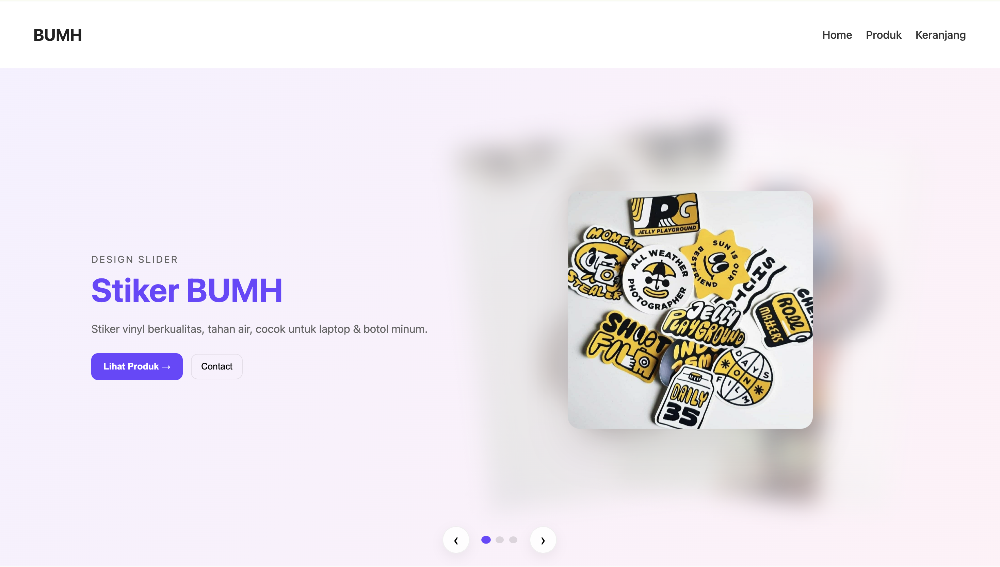
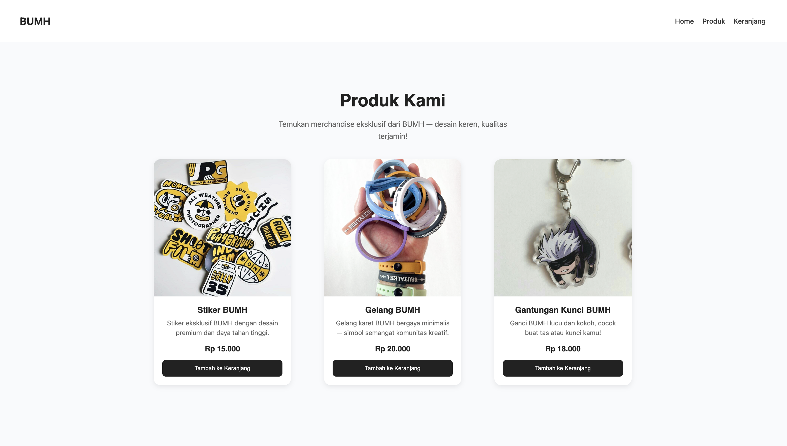
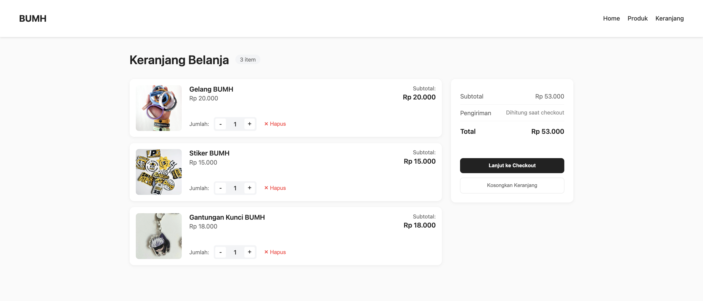
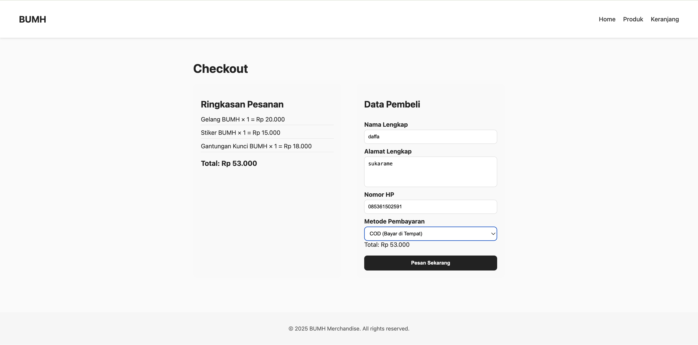

# BUMH Merchandise Web (PAW Praktikum)

Author: MDaffa Hakim
NIM: 123140002

## Deskripsi proyek

Aplikasi satu halaman kecil React + Vite yang menampilkan merchandise (stiker, gelang, gantungan kunci) untuk komunitas bernama BUMH. Aplikasi ini mencakup daftar produk, halaman detail produk, keranjang belanja sederhana yang didukung oleh React Context, dan halaman pembayaran. Penataan gaya dilakukan dengan CSS sederhana yang terletak di bawah `src/styles`.

Proyek ini dibuat untuk tugas praktikum Pemrograman Aplikasi Web (PAW).

## Fitur

- Daftar produk (grid) dengan gambar, harga, dan tombol "Tambah ke Keranjang".
- Halaman detail produk.
- Keranjang belanja yang menyimpan item dan kuantitas menggunakan React Context (`CartContext`).
- Halaman checkout sederhana.
- Komponen terpisah untuk Navbar, Footer, Slider, dan ProductCard.

## Struktur proyek (ringkasan)

- `index.html` - entry HTML
- `src/main.jsx` - React entry, router mounting
- `src/App.jsx` - Route definitions and top-level layout
- `src/components/` - Reusable UI components (Navbar, Footer, ProductCard, Slider, dll.)
- `src/pages/` - Page components (Home, Products, ProductDetail, Cart, Checkout)
- `src/context/CartContext.jsx` - Cart context provider and helpers
- `src/styles/` - CSS files for components and pages
- `src/assets/` - Images used in the project

## Cara menjalankan (lokal)

Prasyarat: Node.js (v16+ recommended) dan npm tersedia.

1. Install dependensi:

```bash
npm install
```

2. Jalankan development server:

```bash
npm run dev
```

3. Buka http://localhost:5173 di browser (Vite akan mencetak alamat sebenarnya di terminal).

4. Untuk build produksi:

```bash
npm run build
npm run preview
```

> Catatan: jika `npm run lint` mengalami error karena konfigurasi ESLint, jalankan hanya `npm run dev` untuk development.

## Dokumentasi singkat komponen utama

- `CartContext.jsx`
	- Export: `CartProvider` dan `useCart()` hook.
	- API: `cartItems`, `addToCart(product)`, `removeFromCart(id)`, `updateQuantity(id, newQty)`, `clearCart()`.
	- Penyimpanan: state lokal React (tidak ada persistence ke localStorage saat ini).

- `Products.jsx`
	- Menampilkan grid produk. Produk saat ini didefinisikan secara lokal di file.
	- Memanggil `addToCart(product)` saat pengguna klik tombol "Tambah ke Keranjang".

- `ProductDetail.jsx`
	- Menyajikan detail produk berdasarkan id route parameter.
	- Memungkinkan menambah produk ke keranjang dari halaman detail.

- `Navbar.jsx` / `Footer.jsx`
	- Layout global dan navigasi. Navbar menampilkan jumlah item di keranjang.

## Cara menambahkan produk baru

1. Tambahkan entri baru pada array produk di `src/pages/Products.jsx` (atau ubah agar produk diambil via API).
2. Pastikan `id` unik dan atribut `name`, `price`, `image`, `desc` tersedia.
3. Gambar dapat disimpan di `src/assets/` dan diimport ke file.

## Catatan pengembangan dan saran

- Menyimpan keranjang ke `localStorage` akan meningkatkan UX (persistensi antar reload).
- Menambahkan validasi jumlah pada `updateQuantity` untuk mencegah nilai negatif.
- Memisahkan model produk ke file tunggal atau backend akan mempermudah ekspansi.

## Kontak

Jika ada pertanyaan tentang proyek ini, hubungi MDaffa Hakim (NIM: 123140002).


### Home


Halaman muka aplikasi: menampilkan slider/hero, pengantar singkat, dan navigasi cepat ke bagian produk.

### Products


Halaman daftar produk (grid). Setiap kartu menampilkan gambar produk, nama, deskripsi singkat, dan tombol "Tambah ke Keranjang". Digunakan untuk browsing dan menambahkan item.


### Cart


Halaman keranjang menampilkan semua item yang ditambahkan, kontrol kuantitas, subtotal per item, dan total pesanan.

### Checkout


Halaman checkout berisi form pengisian data pengiriman dan ringkasan pesanan sebelum konfirmasi.


