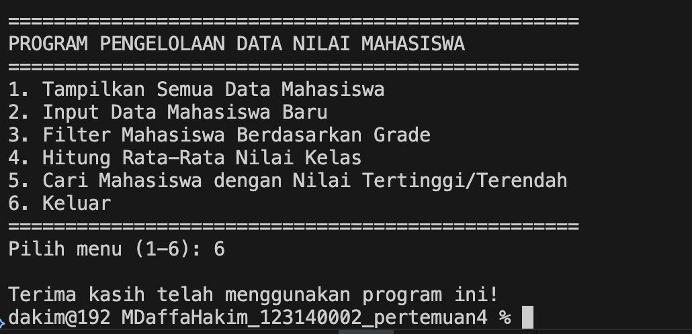
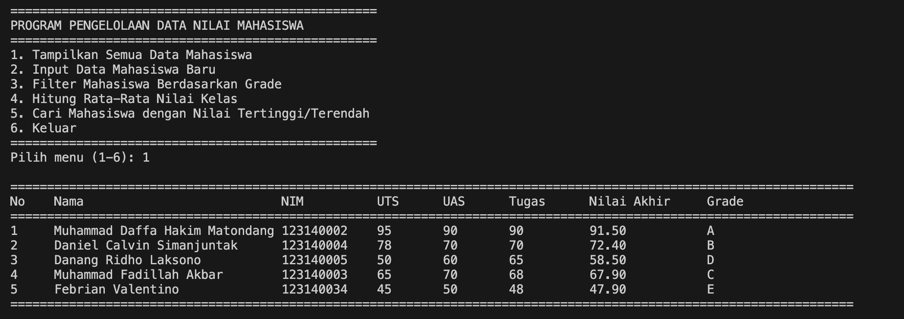
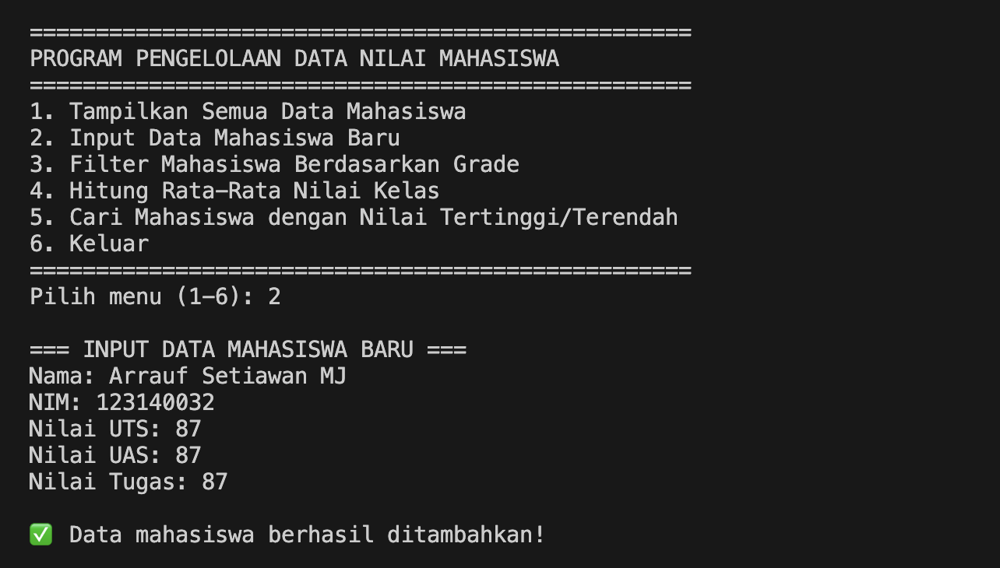
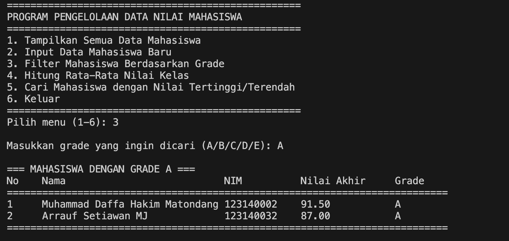
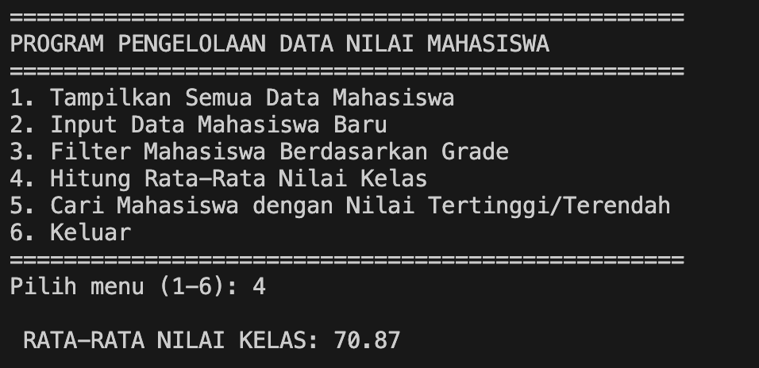
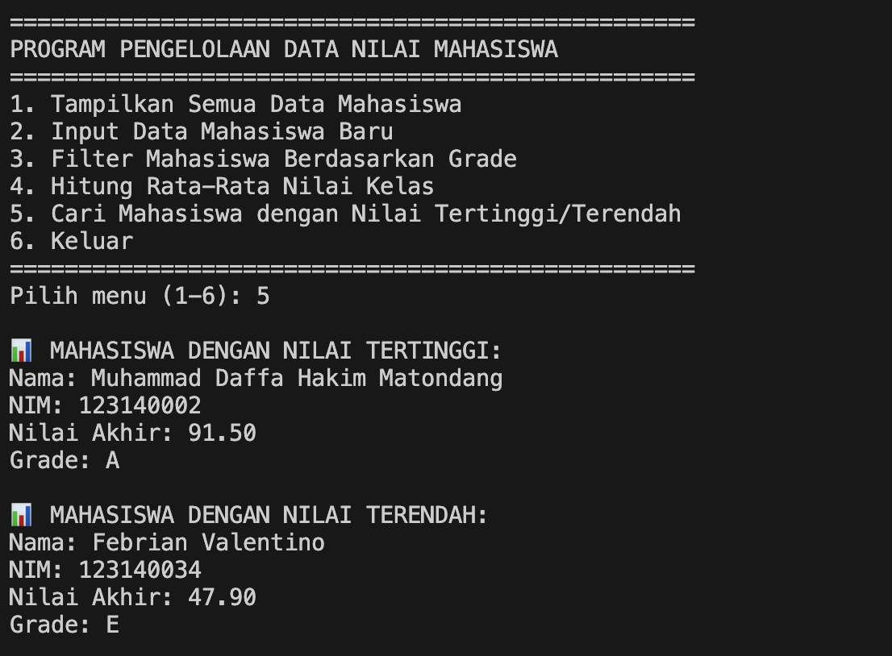

# 📚 Program Pengelolaan Data Nilai Mahasiswa

Program berbasis Python untuk mengelola data nilai mahasiswa dengan fitur perhitungan nilai akhir, penentuan grade, dan berbagai analisis data.

## 👤 Author
**M. Daffa Hakim Matondang**  
NIM: 123140002

## 📋 Deskripsi

Program ini merupakan sistem manajemen nilai mahasiswa yang dapat melakukan:
- Pengelolaan data nilai (UTS, UAS, Tugas)
- Perhitungan nilai akhir otomatis
- Penentuan grade berdasarkan nilai akhir
- Analisis statistik nilai kelas
- Filter data berdasarkan grade

## ✨ Fitur Utama

### 1. 📊 Tampilkan Semua Data Mahasiswa
Menampilkan tabel lengkap berisi:
- Nomor urut
- Nama mahasiswa
- NIM
- Nilai UTS, UAS, dan Tugas
- Nilai Akhir (terkalkulasi)
- Grade

### 2. ➕ Input Data Mahasiswa Baru
Menambahkan data mahasiswa baru dengan input:
- Nama lengkap
- NIM
- Nilai UTS
- Nilai UAS
- Nilai Tugas

### 3. 🔍 Filter Mahasiswa Berdasarkan Grade
Mencari dan menampilkan mahasiswa berdasarkan grade tertentu (A/B/C/D/E)

### 4. 📈 Hitung Rata-Rata Nilai Kelas
Menghitung dan menampilkan rata-rata nilai akhir seluruh mahasiswa

### 5. 🏆 Cari Mahasiswa dengan Nilai Tertinggi/Terendah
Menampilkan informasi lengkap mahasiswa dengan:
- Nilai tertinggi di kelas
- Nilai terendah di kelas

### 6. 🚪 Keluar
Mengakhiri program

## 🧮 Sistem Penilaian

### Formula Nilai Akhir
```
Nilai Akhir = (30% × UTS) + (40% × UAS) + (30% × Tugas)
```

### Skema Grade

| Nilai Akhir | Grade |
|-------------|-------|
| ≥ 80        | A     |
| 70 - 79     | B     |
| 60 - 69     | C     |
| 50 - 59     | D     |
| < 50        | E     |

## 🚀 Cara Menggunakan

### Persyaratan
- Python 3.x terinstal di sistem

### Langkah-langkah

1. **Clone atau download file program**
   ```bash
   # Jika menggunakan git
   git clone <repository-url>
   ```

2. **Jalankan program**
   ```bash
   python nama_file.py
   ```

3. **Navigasi Menu**
   - Pilih nomor menu (1-6) sesuai kebutuhan
   - Ikuti instruksi yang muncul di layar

## 📝 Contoh Penggunaan

### Menampilkan Data
```
Pilih menu (1-6): 1

===================================================================================================================
No    Nama                           NIM          UTS      UAS      Tugas      Nilai Akhir     Grade   
===================================================================================================================
1     Muhammad Daffa Hakim Matondang 123140002    95       90       90         91.50           A       
2     Daniel Calvin Simanjuntak      123140004    78       70       70         72.40           B       
...
```

### Input Data Baru
```
Pilih menu (1-6): 2

=== INPUT DATA MAHASISWA BARU ===
Nama: John Doe
NIM: 123140099
Nilai UTS: 85
Nilai UAS: 88
Nilai Tugas: 90

✅ Data mahasiswa berhasil ditambahkan!
```

### Filter Berdasarkan Grade
```
Pilih menu (1-6): 3

Masukkan grade yang ingin dicari (A/B/C/D/E): A

=== MAHASISWA DENGAN GRADE A ===
No    Nama                           NIM          Nilai Akhir     Grade   
===========================================================================
1     Muhammad Daffa Hakim Matondang 123140002    91.50           A       
```

## 📊 Data Mahasiswa Default

Program sudah dilengkapi dengan 5 data mahasiswa:

1. Muhammad Daffa Hakim Matondang (123140002)
2. Daniel Calvin Simanjuntak (123140004)
3. Danang Ridho Laksono (123140005)
4. Muhammad Fadillah Akbar (123140003)
5. Febrian Valentino (123140034)

## 🔧 Struktur Fungsi

| Fungsi | Deskripsi |
|--------|-----------|
| `hitung_nilai_akhir()` | Menghitung nilai akhir berdasarkan formula |
| `tentukan_grade()` | Menentukan grade dari nilai akhir |
| `tampilkan_tabel()` | Menampilkan data dalam format tabel |
| `cari_mahasiswa_ekstrem()` | Mencari mahasiswa dengan nilai tertinggi/terendah |
| `input_mahasiswa_baru()` | Menambah data mahasiswa baru |
| `filter_berdasarkan_grade()` | Filter mahasiswa berdasarkan grade |
| `hitung_rata_rata()` | Menghitung rata-rata nilai kelas |
| `menu_utama()` | Menampilkan menu dan menjalankan program |

## 💡 Tips Penggunaan

- Input nilai harus berupa angka (integer atau float)
- Grade yang valid: A, B, C, D, E (huruf besar)
- Data mahasiswa tersimpan selama program berjalan (tidak permanen)
- Gunakan Ctrl+C untuk keluar paksa jika diperlukan

## 🐛 Error Handling

Program ini sudah dilengkapi dengan validasi dasar:
- Validasi pilihan menu (1-6)
- Validasi input grade (A/B/C/D/E)
- Pengecekan data kosong pada filter

## 📄 Lisensi

Program ini dibuat untuk keperluan akademis dan pembelajaran.

## 📸 Dokumentasi Screenshot

### Menu Utama

> Tampilan menu utama program dengan 6 pilihan fitur

### Tampilan Data Mahasiswa

> Tabel lengkap data mahasiswa dengan nilai dan grade

### Input Data Mahasiswa Baru

> Form input untuk menambahkan mahasiswa baru

### Filter Berdasarkan Grade

> Hasil filter mahasiswa berdasarkan grade tertentu

### Rata-Rata Nilai Kelas

> Perhitungan dan tampilan rata-rata nilai kelas

### Mahasiswa Nilai Tertinggi dan Terendah

> Informasi mahasiswa dengan nilai tertinggi dan terendah

## 📁 Struktur Folder

```
project/
│
├── Penilaian.py           # File program utama
├── README.md              # Dokumentasi program
│
└── screenshots/           # Folder dokumentasi gambar
    ├── menu_utama.png
    ├── tabel_data.png
    ├── input_data.png
    ├── filter_grade.png
    ├── rata_rata.png
    └── nilai_ekstrem.png
```


## 📞 Kontak

Untuk pertanyaan atau saran, silakan hubungi:
- **Nama**: M. Daffa Hakim Matondang
- **NIM**: 123140002

---

⭐ **Happy Coding!** ⭐