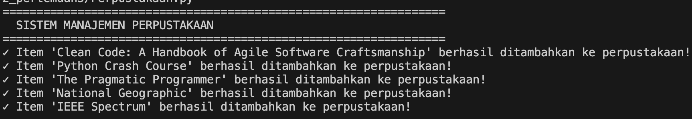
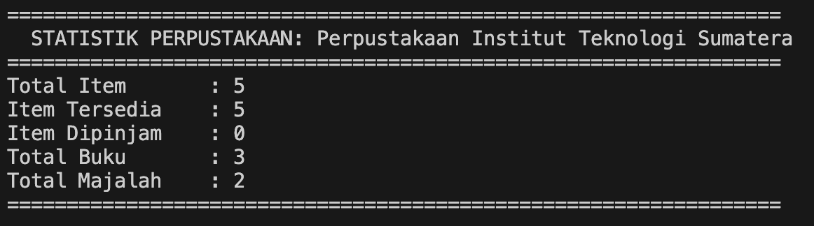
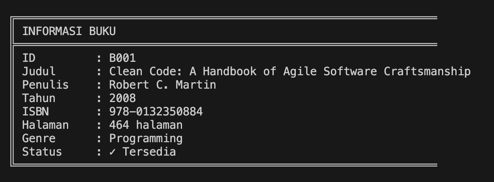
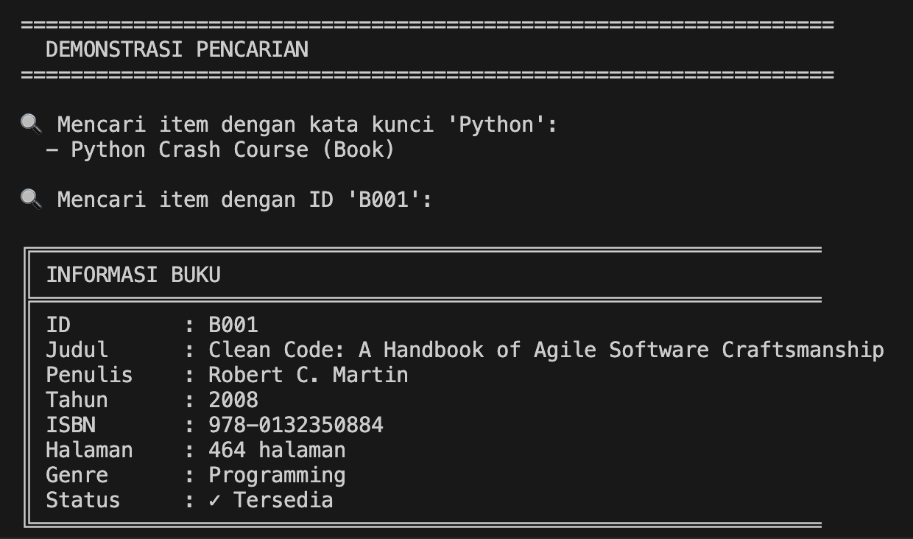
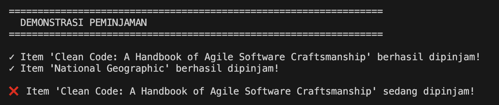
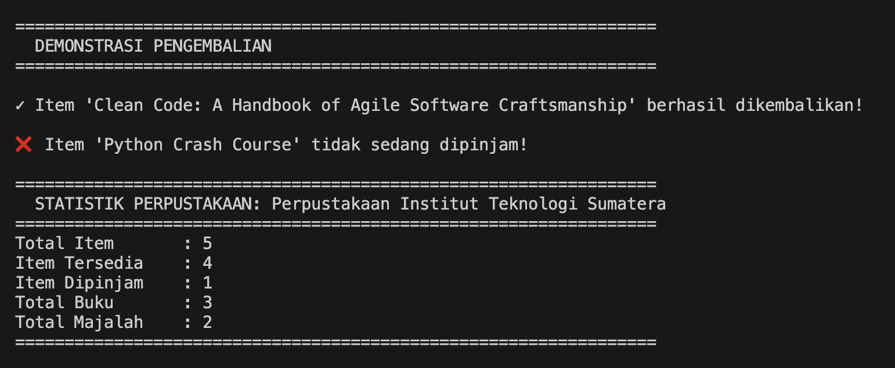

# Sistem Manajemen Perpustakaan Sederhana

## Deskripsi Program

Program ini adalah implementasi sistem manajemen perpustakaan sederhana menggunakan konsep **Object-Oriented Programming (OOP)** dalam Python. Sistem ini memungkinkan pengelolaan koleksi perpustakaan yang terdiri dari berbagai jenis item seperti buku dan majalah.

## Fitur Program

1. **Manajemen Item Perpustakaan**
   - Menambahkan buku dan majalah ke koleksi perpustakaan
   - Menyimpan informasi detail untuk setiap item
   - Tracking status ketersediaan item (tersedia/dipinjam)

2. **Pencarian Item**
   - Mencari item berdasarkan judul (case-insensitive)
   - Mencari item berdasarkan ID unik

3. **Peminjaman dan Pengembalian**
   - Meminjam item dari perpustakaan
   - Mengembalikan item ke perpustakaan
   - Validasi status item sebelum peminjaman/pengembalian

4. **Statistik dan Laporan**
   - Menampilkan statistik perpustakaan (total item, tersedia, dipinjam)
   - Menampilkan daftar lengkap koleksi
   - Kategorisasi berdasarkan tipe item

## Konsep OOP yang Diimplementasikan

### 1. Abstract Class
- `LibraryItem` sebagai abstract base class
- Mendefinisikan method abstract: `get_item_type()` dan `display_info()`
- Memaksa setiap subclass untuk mengimplementasikan method tersebut

### 2. Inheritance (Pewarisan)
- `Book` mewarisi dari `LibraryItem`
- `Magazine` mewarisi dari `LibraryItem`
- Setiap subclass menggunakan `super()` untuk memanggil constructor parent class

### 3. Encapsulation
**Private attributes** menggunakan double underscore (`__`):
- `__item_id` di `LibraryItem`
- `__isbn` di `Book`
- `__name`, `__items`, `__borrowed_count` di `Library`

**Protected attributes** menggunakan single underscore (`_`):
- `_title`, `_author`, `_year` di `LibraryItem`
- `_pages`, `_genre` di `Book`
- `_issue_number`, `_month` di `Magazine`

**Property Decorators**:
- Getter untuk membaca atribut private/protected
- Setter dengan validasi untuk atribut tertentu (contoh: `title` tidak boleh kosong)
- Read-only properties (contoh: `item_id`, `isbn`)

### 4. Polymorphism
- Method `display_info()` diimplementasikan berbeda di setiap subclass
- Method `get_item_type()` mengembalikan nilai berbeda sesuai tipe item
- Library dapat mengelola berbagai tipe item melalui interface yang sama

### 5. Type Hinting
- Penggunaan type hints untuk parameter dan return values
- Meningkatkan readability dan maintainability kode

## 📁 Struktur Class

```
LibraryItem (Abstract Base Class)
│
├── Book (Subclass)
│   ├── Attributes: isbn, pages, genre
│   └── Methods: get_item_type(), display_info()
│
└── Magazine (Subclass)
    ├── Attributes: issue_number, month
    └── Methods: get_item_type(), display_info()

Library (Manager Class)
├── Private Attributes: __name, __items, __borrowed_count
└── Methods: add_item(), search_by_title(), search_by_id(),
             borrow_item(), return_item(), display_all_items(),
             display_statistics()
```

## 🚀 Cara Menjalankan Program

1. **Pastikan Python 3.x terinstall**
   ```bash
   python --version
   ```

2. **Jalankan program**
   ```bash
   python library_system.py
   ```

3. **Output yang dihasilkan**
   - Program akan otomatis mendemonstrasikan semua fitur
   - Menampilkan proses penambahan item
   - Menampilkan pencarian item
   - Menampilkan peminjaman dan pengembalian
   - Menampilkan statistik perpustakaan

## 📸 Screenshot Hasil Running Program

### 1. Tampilan Awal dan Penambahan Item

```
=================================================================
  SISTEM MANAJEMEN PERPUSTAKAAN
=================================================================
✓ Item 'Clean Code: A Handbook of Agile Software Craftsmanship' berhasil ditambahkan ke perpustakaan!
✓ Item 'Python Crash Course' berhasil ditambahkan ke perpustakaan!
✓ Item 'The Pragmatic Programmer' berhasil ditambahkan ke perpustakaan!
✓ Item 'National Geographic' berhasil ditambahkan ke perpustakaan!
✓ Item 'IEEE Spectrum' berhasil ditambahkan ke perpustakaan!
```

### 2. Statistik Perpustakaan

```
=================================================================
  STATISTIK PERPUSTAKAAN: Perpustakaan Institut Teknologi Sumatera
=================================================================
Total Item       : 5
Item Tersedia    : 5
Item Dipinjam    : 0
Total Buku       : 3
Total Majalah    : 2
=================================================================
```

### 3. Daftar Koleksi (Contoh Output Buku)

```
╔═══════════════════════════════════════════════════════════════
║ INFORMASI BUKU
╠═══════════════════════════════════════════════════════════════
║ ID         : B001
║ Judul      : Clean Code: A Handbook of Agile Software Craftsmanship
║ Penulis    : Robert C. Martin
║ Tahun      : 2008
║ ISBN       : 978-0132350884
║ Halaman    : 464 halaman
║ Genre      : Programming
║ Status     : ✓ Tersedia
╚═══════════════════════════════════════════════════════════════
```

### 4. Demonstrasi Pencarian

```
=================================================================
  DEMONSTRASI PENCARIAN
=================================================================

🔍 Mencari item dengan kata kunci 'Python':
  - Python Crash Course (Book)

🔍 Mencari item dengan ID 'B001':
[Menampilkan detail lengkap item]
```

### 5. Demonstrasi Peminjaman

```
=================================================================
  DEMONSTRASI PEMINJAMAN
=================================================================

✓ Item 'Clean Code: A Handbook of Agile Software Craftsmanship' berhasil dipinjam!
✓ Item 'National Geographic' berhasil dipinjam!

❌ Item 'Clean Code: A Handbook of Agile Software Craftsmanship' sedang dipinjam!
```

### 6. Demonstrasi Pengembalian

```
=================================================================
  DEMONSTRASI PENGEMBALIAN
=================================================================

✓ Item 'Clean Code: A Handbook of Agile Software Craftsmanship' berhasil dikembalikan!

❌ Item 'Python Crash Course' tidak sedang dipinjam!
```

## 🎓 Penjelasan Konsep OOP

### Encapsulation (Pembungkusan)
Program ini mendemonstrasikan encapsulation dengan:
- Menyembunyikan data sensitif menggunakan private attributes (`__`)
- Menyediakan akses terkontrol melalui property decorators
- Validasi input pada setter methods untuk menjaga integritas data

**Contoh dalam kode:**
```python
# Private attribute - tidak bisa diakses langsung dari luar class
self.__item_id = item_id

# Property getter - cara yang aman untuk mengakses private attribute
@property
def item_id(self) -> str:
    return self.__item_id
```

### Inheritance (Pewarisan)
- `Book` dan `Magazine` mewarisi struktur dasar dari `LibraryItem`
- Setiap subclass menambahkan atribut spesifik sesuai kebutuhannya
- Menggunakan `super()` untuk memanggil constructor parent class

**Contoh dalam kode:**
```python
class Book(LibraryItem):
    def __init__(self, item_id, title, author, year, isbn, pages, genre):
        # Mewarisi constructor dari parent class
        super().__init__(item_id, title, author, year)
        # Menambahkan atribut spesifik untuk Book
        self.__isbn = isbn
        self._pages = pages
```

### Polymorphism (Polimorfisme)
- Method `display_info()` berperilaku berbeda untuk setiap tipe item
- Library dapat mengelola berbagai tipe item tanpa perlu tahu detail implementasinya
- Setiap objek merespon method yang sama dengan cara yang berbeda

**Contoh dalam kode:**
```python
# Setiap item memanggil display_info() sesuai tipenya
for item in self.__items:
    print(item.display_info())  # Polymorphism in action!
```

### Abstraction (Abstraksi)
- `LibraryItem` sebagai abstract class mendefinisikan kontrak
- Memaksa consistency pada semua item perpustakaan
- Menyembunyikan kompleksitas implementasi dari user

**Contoh dalam kode:**
```python
@abstractmethod
def display_info(self) -> str:
    """Method abstract yang HARUS diimplementasikan oleh subclass"""
    pass
```

## Diagram Class

```
┌─────────────────────────────────┐
│      <<abstract>>               │
│      LibraryItem                │
├─────────────────────────────────┤
│ - __item_id: str                │
│ # _title: str                   │
│ # _author: str                  │
│ # _year: int                    │
│ # _is_available: bool           │
├─────────────────────────────────┤
│ + get_item_type(): str          │◄────────────────┐
│ + display_info(): str           │                 │
│ + borrow(): bool                │                 │
│ + return_item(): bool           │                 │
└─────────────────────────────────┘                 │
           △                                        │
           │                                        │
    ┌──────┴──────┐                                │
    │             │                                 │
┌───▼────┐    ┌───▼────┐                    ┌──────▼─────┐
│ Book   │    │Magazine│                    │  Library   │
├────────┤    ├────────┤                    ├────────────┤
│-__isbn │    │-_issue │                    │-__name     │
│-_pages │    │-_month │                    │-__items[]  │
├────────┤    ├────────┤                    │-__borrowed │
│+...    │    │+...    │                    ├────────────┤
└────────┘    └────────┘                    │+add_item() │
                                            │+search()   │
                                            │+borrow()   │
                                            └────────────┘
```

## 💡 Tips Pengembangan Lebih Lanjut

1. **Tambah Tipe Item Baru**
   - Buat class baru yang inherit dari `LibraryItem`
   - Implementasikan method abstract yang required
   - Tambahkan atribut spesifik sesuai kebutuhan
   - Contoh: DVD, E-Book, Newspaper

2. **Sistem Member/Anggota**
   - Buat class `Member` untuk menyimpan data anggota
   - Track history peminjaman per member
   - Implementasi batas maksimal peminjaman
   - Sistem denda untuk keterlambatan

3. **Persistensi Data**
   - Simpan data ke file JSON atau database
   - Load data saat program dimulai
   - Auto-save saat ada perubahan
   - Export data ke CSV/Excel

4. **GUI Interface**
   - Implementasi menggunakan Tkinter atau PyQt
   - Buat form untuk input data
   - Tambah visualisasi statistik
   - Dashboard untuk monitoring

5. **Fitur Tambahan**
   - Sistem reservasi untuk item yang sedang dipinjam
   - Rating dan review untuk item
   - Rekomendasi berdasarkan history peminjaman
   - Notifikasi untuk pengembalian

## Catatan Penting

1. **Validasi Input**: Program menggunakan property decorators untuk validasi otomatis
2. **Error Handling**: Setiap operasi memiliki pengecekan error yang komprehensif
3. **Type Safety**: Menggunakan type hints untuk clarity dan IDE support
4. **Documentation**: Setiap class dan method memiliki docstring yang jelas
5. **Clean Code**: Mengikuti PEP 8 style guide untuk Python
6. **Extensibility**: Design yang memudahkan penambahan fitur baru

## 🔧 Troubleshooting

### Program tidak bisa dijalankan
- Pastikan Python 3.x sudah terinstall
- Cek apakah file `library_system.py` ada di directory yang benar

### Import error dari abc module
- Pastikan menggunakan Python 3.4 atau lebih baru
- Module `abc` sudah built-in di Python 3.x

### Encoding error pada output
- Pastikan terminal/console support UTF-8
- Di Windows, jalankan `chcp 65001` di CMD sebelum run program

## Author

**[Muhammad Daffa Hakim Matondang]**
- NIM: 123140002
- Kelas: Pemrograman Aplikasi dan Web RB
- Program Studi: Teknik Informatika
- Praktikum: Python OOP - Pertemuan 5
- Tanggal: 15 November 2025

## Referensi

- Python Official Documentation: https://docs.python.org/3/
- Python ABC Module: https://docs.python.org/3/library/abc.html
- PEP 8 Style Guide: https://pep8.org/
- Real Python OOP Tutorial: https://realpython.com/python3-object-oriented-programming/
- Python Type Hints: https://docs.python.org/3/library/typing.html

